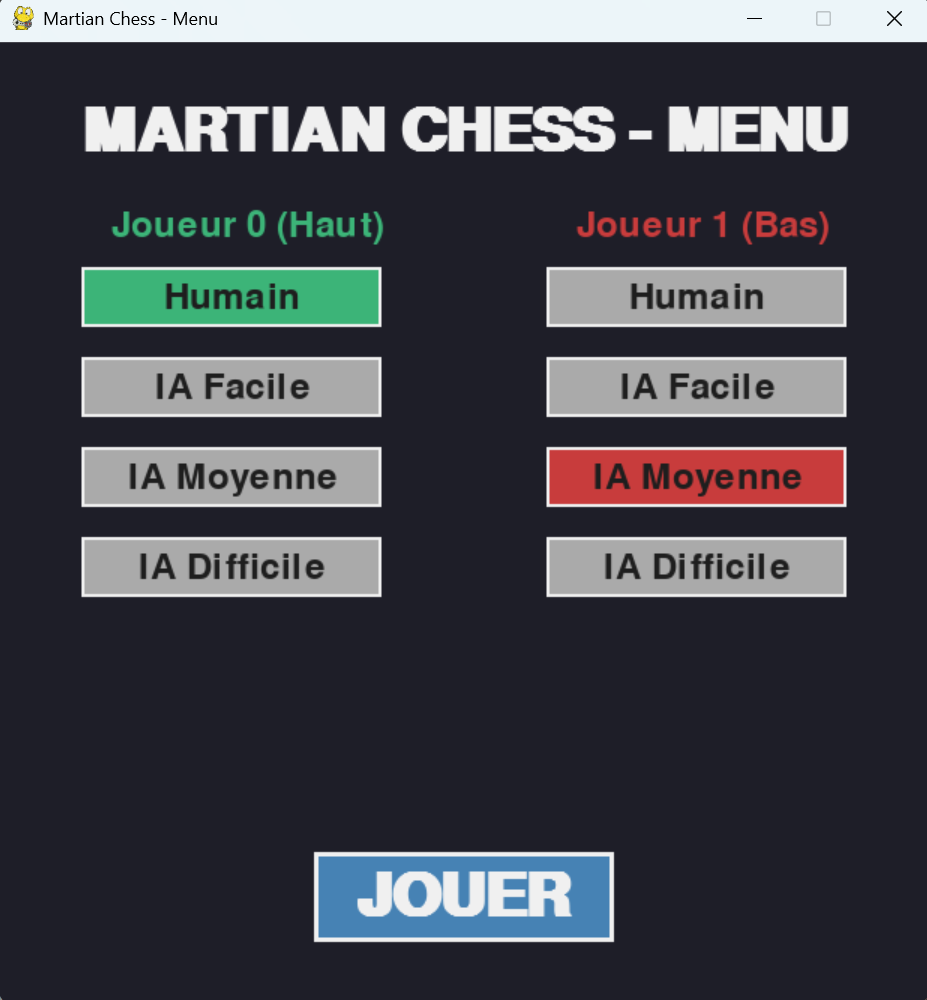
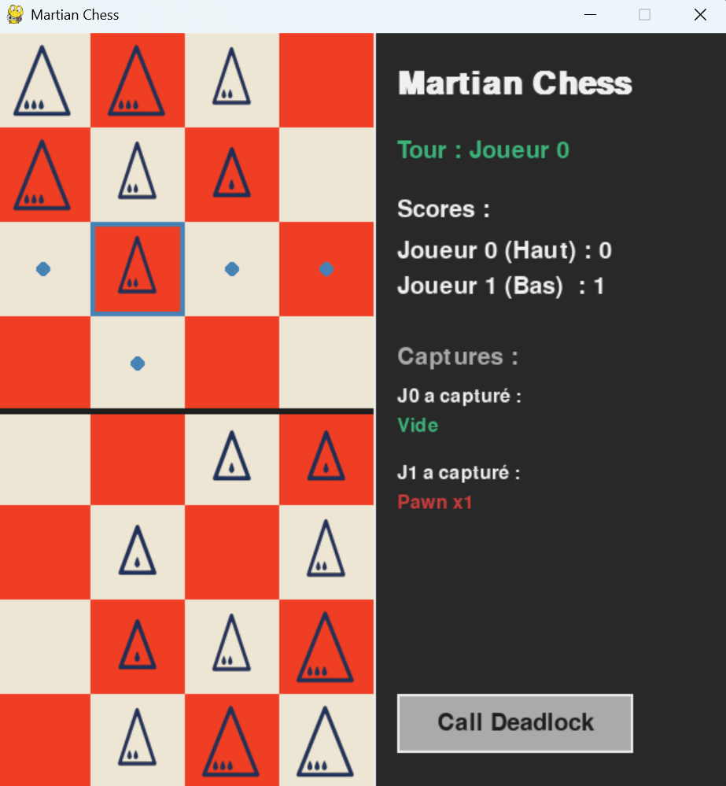

# 👽 Martian Chess : Moteur d'Intelligence Artificielle


Ce projet implémente un moteur de jeu et une Intelligence Artificielle pour le **Jeu d'échecs martien**. L'objectif principal est la conception d'agents intelligents capables d'évaluer des états de jeu complexes, d'anticiper les coups adverses et d'optimiser leur temps de réflexion grâce à des algorithmes de recherche heuristique.




---

## 🧠 Moteur d'Intelligence Artificielle

L'agent intelligent développé repose sur les concepts fondamentaux de la théorie des jeux :

* **Algorithme Minimax :** Exploration de l'arbre des possibles pour maximiser les gains de l'IA tout en minimisant ceux de l'adversaire.
* **Élagage Alpha-Bêta :** Optimisation majeure du Minimax permettant de couper les branches de l'arbre de recherche inutiles, réduisant drastiquement le temps de calcul.
* **Heuristiques personnalisées :** Fonctions d'évaluation statique (matériel, contrôle du centre, mobilité) pour estimer la valeur d'un plateau de jeu à une profondeur donnée.

### 🎚️ Niveaux de difficulté
L'IA propose 3 niveaux de difficulté distincts, basés sur la profondeur de l'arbre de recherche et la complexité de l'heuristique :
1. **Facile :** Profondeur très faible ou coups aléatoires (idéal pour les tests de base).
2. **Moyenne :** Profondeur intermédiaire avec heuristique matérielle de base.
3. **Difficile :** Profondeur élevée avec élagage Alpha-Bêta complet et heuristique positionnelle avancée.

---

## 📊 Étude Scientifique et Tournois d'IA

Pour valider la robustesse de notre moteur, nous avons mis en place un système de tournois automatisés (`tournament.py`) faisant s'affronter les différentes IA sur des dizaines de parties pour récolter des données précises (temps de réflexion, facteur de branchement, taux de victoire...).

🔬 **L'étude scientifique de ces résultats a été menée sous tous les angles** (impact de la profondeur, temps de calcul, évaluation des heuristiques, parties avec profondeur égale ou aléatoire). 
👉 **Tous les détails et les analyses complètes se trouvent dans le fichier PDF :** `Rapport de projet et de l'étude scientifique.pdf` **présent à la racine du dépôt.**

**Aperçu des performances (Tournoi classique) :**

| Affrontement | Victoires IA 1 | Victoires IA 2 | Temps moyen/partie | Temps moyen/coup (IA Difficile) |
| :--- | :---: | :---: | :---: | :---: |
| **Facile vs Facile** | 25 | 25 | ~0.38 s | - |
| **Facile vs Difficile** | 0 | **50** | ~44.5 s | ~1.85 s |
| **Moyenne vs Difficile** | 0 | **50** | ~74.0 s | ~2.90 s |
| **Difficile vs Difficile**| 25 | 25 | ~121.5 s | ~1.93 s |

*L'IA "Difficile" domine totalement les niveaux inférieurs avec un taux de victoire de 100%, démontrant l'efficacité de la profondeur de recherche couplée à l'élagage Alpha-Bêta.*

---

## 🚀 Installation et Exécution

### 1. Création de l'environnement virtuel

**Sur Windows :**
```cmd
python -m venv venv
.\venv\Scripts\activate

```

**Sur Mac/Linux :**

```bash
python3 -m venv venv
source venv/bin/activate

```

### 2. Installation des dépendances

Le projet requiert notamment la bibliothèque `pygame` pour l'interface graphique.

```bash
pip install -r requirements.txt

```

### 3. Lancement

Depuis la racine du projet (`MartianChess/`), utilisez les commandes suivantes :

* **Pour jouer une partie (Humain vs Humain ou Humain vs IA) :**
```bash
python src/main.py

```


* **Pour lancer un tournoi automatisé entre IA :**
```bash
python experiments/tournament.py

```


---

## 📂 Arborescence du Projet

```text
MartianChess/
│
├── README.md               # Documentation du projet
├── requirements.txt        # Bibliothèques utilisées (pygame)
├── Rapport de projet et de l'étude scientifique.pdf
│
├── src/                    # Code source principal
│   ├── constants.py        # Configuration globale (tailles, valeurs)
│   ├── model.py            # Structure de l'état du jeu (State)
│   ├── rules.py            # Logique de déplacement et validation
│   ├── view.py             # Interface graphique Pygame
│   ├── main.py             # Boucle de jeu (Controller)
│   ├── player.py           # Classe parent pour Humains et IA
│   │
│   └── ai/                 # Logique d'Intelligence Artificielle
│       ├── minimax.py      # Algorithme Minimax et Alpha-Bêta
│       └── heuristics.py   # Fonctions d'évaluation des plateaux
│
└── experiments/
    └── tournament.py       # Script d'arène pour faire s'affronter les IA

```

---

*Projet d'Intelligence Artificielle 2025/2026 - Réalisé par Yanis Hammaoui et Rayane Kachbi.*
